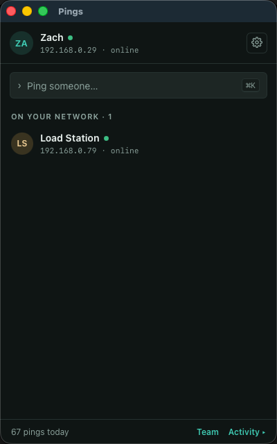
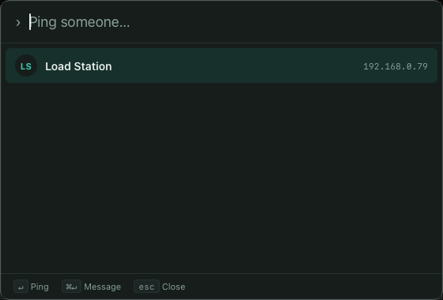

# Pings

> **See who's around. Ping them in one keystroke.**
>
> **Beta 0.3.5** — macOS is the primary build; a Linux build is in beta.

Pings is a lightweight **presence utility** that lives in your menubar. It shows
everyone on your local network and lets you get someone's attention instantly — a
full-screen flash of colour on *their* screen — without a chat app, an account,
or a server in the middle. Everything travels directly, peer-to-peer, over your
LAN. macOS is the primary target (Apple Silicon + Intel); Linux is now building
in beta, with macOS features flowing into it as they land.

<p align="center">
  
  &nbsp;&nbsp;
  
</p>

---

## What it does

**Presence at a glance.** A compact buddy list — you at the top, then everyone
on the network, one row each, with a presence dot and last-seen. Hover a row for
**Message** and an amber **Ping**; double-click to ping. That's the whole window.

**Ping in one keystroke.** The point of the app is that reaching someone is
never more than a keystroke away:
- **⌘⇧K** summons a command palette from anywhere — type two letters of a name,
  **Enter** to ping, **⌘Enter** to message.
- The **menubar tray** lists everyone around for a one-click ping.
- In the window, **⌘K** filters the list; Enter pings the top match.

**The attention flash.** The soul of the app — a whole-screen, click-through,
always-on-top border (or circle) that flashes on the recipient's display. Fully
tunable: colour, thickness, feather, duration, and shape.

**Quick-reply toast.** An incoming ping raises a small card, top-right, with the
sender, their message, and one-tap replies. It's a **non-activating panel**, so
it never steals focus from what you're doing and its replies send on the first
click.

**Do Not Disturb.** Flip it on and incoming pings make no flash, no toast, no
sound — but still land in your activity feed.

**Real messages, real delivery.** Direct messages and team chat with honest
delivery states — **✓ sent → ✓✓ delivered** once the other side receives it — and
a merged activity timeline, all persisted across restarts.

**Agent peers.** Because peers are stable identities speaking a documented
protocol, an AI agent can join the network as *just another peer* — it shows up
in the buddy list with an **AI** badge and you ping and DM it like anyone else.
A [reference bridge](./agent-bridge) plugs a local model (Ollama) into the
network in ~150 lines, and the [protocol](./docs/PROTOCOL.md) lets anyone write
their own.

**Quiet, native design.** System fonts, one accent colour spent carefully,
token-based light/dark that's a single swap, no gradients and no runtime CDNs.
First-run onboarding asks your name and previews the ping effect.

**Signed auto-updates.** HTTPS updates from GitHub Releases, signature-verified
before installing.

## How it works

- Built on **[Tauri](https://tauri.app)** — a Rust core with a web UI — macOS
  first (Apple Silicon + Intel), with a Linux build (`.deb` / `.AppImage` /
  `.rpm`) in beta. The macOS-only bits (the non-activating NSPanel toast) are
  cfg-gated and fall back to a normal window elsewhere.
- **No servers, no cloud, no accounts.** Peers are discovered on your LAN via
  **mDNS/Bonjour**; pings and messages travel directly over **UDP**.
- **Stable identity:** every peer has a persistent `peerId`, so aliases, history,
  and delivery all key off identity rather than a DHCP-assigned IP. One JSON
  envelope protocol on two ports, with acks for delivery states — the full wire
  contract is in **[docs/PROTOCOL.md](./docs/PROTOCOL.md)**.
- **Persistence:** SQLite keeps every ping and message across restarts.

## Status

**Beta 0.3.5.** The full v3 line is built and verified on real Mac hardware, and
a Linux build is now in beta testing:

| Phase | What |
|-------|------|
| v3.0 | peerId + envelope protocol + acks, single-runtime networking, SQLite store |
| v3.1 | redesigned buddy-list shell + single settings window on a shared design system |
| v3.2 | tray quick-ping, global shortcut, ⌘K palette, overlay v2, DND, onboarding |
| v3.3 | agent peers + reference bridge + published protocol |
| v3.4 | signed HTTPS updater, real CSP, packaging |
| Linux (beta) | cross-platform build — macOS-only NSPanel cfg-gated, `.deb`/`.AppImage`/`.rpm` in CI |

macOS is the primary build; the Linux beta follows behind, picking up macOS
features as they stabilise. Linux auto-update isn't wired yet — beta testers
re-download new builds for now. Windows is a possible future port.

## Install it on a machine

Pings isn't code-signed with an Apple Developer ID yet, so the cleanest way to
put it on a Mac today is to **clone and build it** — a locally built app runs
straight away, without the Gatekeeper prompt a downloaded unsigned `.dmg` would
trigger.

### Clone & build (current method)

Needs the Xcode command-line tools, [Rust](https://rustup.rs), and Node 18+:

```bash
# one-time toolchain (skip whatever you already have)
xcode-select --install
curl --proto '=https' --tlsv1.2 -sSf https://sh.rustup.rs | sh
brew install node

# pull, build, install
git clone https://github.com/southcitycapture/Pings-Local.git
cd Pings-Local
npm install
npm run tauri build -- --config '{"bundle":{"createUpdaterArtifacts":false}}'
open src-tauri/target/release/bundle/dmg/     # drag Pings.app to Applications
```

The `--config` flag skips the signed-updater artifacts (which need the release
signing key), so no key is required for a local install. To just run it without
installing, use `npm run tauri dev`.

### Linux (beta)

The Linux build is in beta. Grab a `.deb`, `.AppImage`, or `.rpm` from a
published release, or build it yourself. Building needs [Rust](https://rustup.rs),
Node 18+, and the WebKitGTK / GTK system libraries:

```bash
# Debian/Ubuntu system deps
sudo apt-get install -y \
  libwebkit2gtk-4.1-dev libgtk-3-dev libayatana-appindicator3-dev \
  librsvg2-dev libssl-dev libxdo-dev build-essential curl wget file patchelf

# pull, build, install
git clone https://github.com/southcitycapture/Pings-Local.git
cd Pings-Local
npm install
npm run tauri build -- --config '{"bundle":{"createUpdaterArtifacts":false}}'
# installers land in src-tauri/target/release/bundle/{deb,appimage,rpm}/
```

The quick-reply toast falls back to a normal always-on-top window on Linux (the
non-activating panel is macOS-only); everything else — discovery, the attention
flash, chat, agents — works the same.

### Download a release (once one is published)

When a release is cut (see [Building a release](#building-a-release)), installing
becomes a plain download — no toolchain needed. Grab the `.dmg` on macOS, or the
`.deb` / `.AppImage` / `.rpm` on Linux:

```bash
# macOS
gh release download --repo southcitycapture/Pings-Local --pattern "*.dmg"
open Pings_*.dmg     # right-click → Open on first launch until notarized

# Linux (pick your format)
gh release download --repo southcitycapture/Pings-Local --pattern "*.AppImage"
chmod +x Pings_*.AppImage && ./Pings_*.AppImage
```

## Getting started (development)

```bash
npm install
npm run tauri dev
```

You need **two machines on the same Wi-Fi / subnet** to see each other — some
guest and corporate networks isolate clients; see
[docs/TESTING.md](./docs/TESTING.md) for the network gotchas. To try an AI peer
on one machine, see [agent-bridge](./agent-bridge).

### Building a release

Releases are built by CI on a version tag — see
[UPDATER_SETUP.md](./UPDATER_SETUP.md). In short: bump the version, push a `v*`
tag, and GitHub Actions builds a `macOS + Linux` matrix into a **draft** release —
a signed universal `.dmg` (with the macOS auto-update manifest) plus Linux
`.deb` / `.AppImage` / `.rpm`.

## Docs

- **[docs/PROTOCOL.md](./docs/PROTOCOL.md)** — the wire protocol (build your own peer or agent)
- **[V3_PLAN.md](./V3_PLAN.md)** — design direction, architecture, and roadmap
- **[docs/PRODUCT-LINE.md](./docs/PRODUCT-LINE.md)** — the road past 1.0: Pings (free) · Pings Dispatch (server, paid) · Pings Go! (mobile)
- **[docs/DISPATCH-PLAN.md](./docs/DISPATCH-PLAN.md)** — the phased build plan for Dispatch and Go!
- **[agent-bridge/](./agent-bridge)** — the reference AI-peer daemon
- **[UPDATER_SETUP.md](./UPDATER_SETUP.md)** — updater and release process
- **[docs/TESTING.md](./docs/TESTING.md)** — two-machine testing and network notes
</content>
